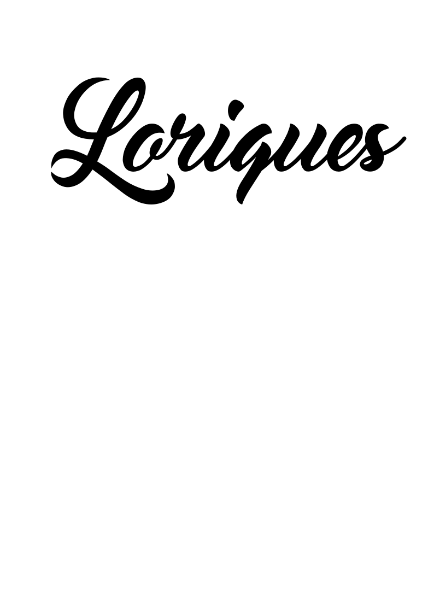
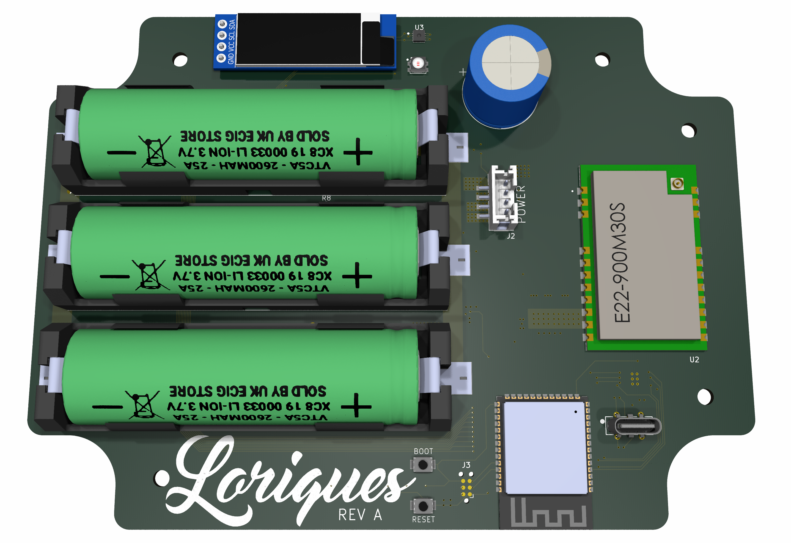

Loriques is a solar powered Meshtastic LoRa gateway. *Warning: Loriques is very much a work in progress.*

- Designed to work with a small 6V solar panel. Like the [Voltaic 6 Watt Panel](https://voltaicsystems.com/6-watt-panel/)
- [EBYTE E22-900M30S](https://www.cdebyte.com/products/E22-900M30S/3) 30dBm LoRa tranciever
  - Untested; I picked this because it's in the Meshtastic supported LoRa ISM band, and it has one of the highest listed output power of LoRa modules.
  - Selecting a good high-gain antenna for this module is TBD.
- ESP32S3 WiFi and BLE SoC
- OLED Display
- Holders for three 18650 Lithium Ion batteries
- MCP73871 Solar charge controller
  - Optimized for solar charging and load sharing, but not a "true MPPT" controller. More info from [Adafruit](https://learn.adafruit.com/usb-dc-and-solar-lipoly-charger/design-notes)
- MAX17263 Battery fuel Guage
- HDC3020 Temperature and humidity sensor
  - This is helpful for monitoring how waterproof your outdoor enclosure is. 
- Very low noise, filtered 3.3V voltage regulator
- PCB designed to fit into the [Polycase ML-46F](https://www.polycase.com/ml-46f#ML-46F*15) Outdoor NEMA Enclosure
- ESP32 Firmware is **not** started yet!
  - There are some big challenges here, like getting the ESP32S3 and it's radios in, and out of a low power state.
